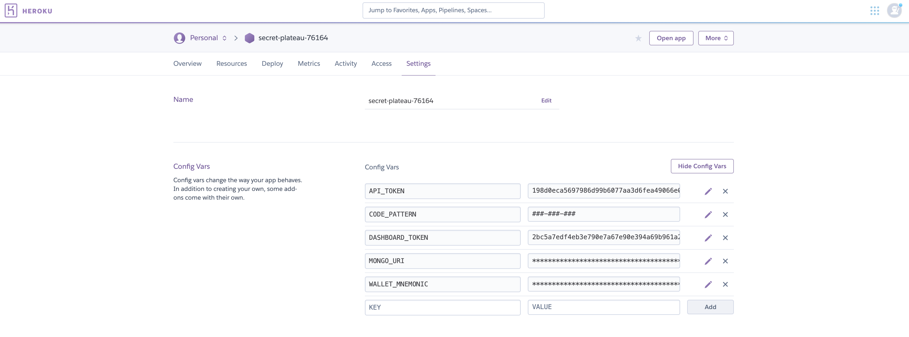

# Redemption Server

This is an open source tool that allows you to generate single-use links that redeem crypto to Trust Wallet. It can be used to run a gift card or promotional airdrop campaign.

Redemption currently supports Binance Chain, and will add support for more chains over time.

> Redemption is beta software, and currently has the bare-minimum of security features. Use at your own risk!

## Quick start

1. Deploy this template to Heroku. It should guide you through the setup process.

2. The Heroku going to autogenerate two tokens for you, one to access your dashboard (`DASHBOARD_TOKEN`) and another one to reach the redeem API (`API_TOKEN`). You can get both inside the Heroku environment variables.

3. Navigate to the Heroku URL (e.g. https://your-redemption-server29189.herokuapp.com) and enter the `DASHBOARD_TOKEN` that you chose in Step 1 in the dashboard.

4. Use the dashboard to create links. We use [Trust Wallet's Assets Info](https://github.com/trustwallet/assets) for token IDs (e.g. BNB for Binance Coin, BUSD-BD1 for Binance USD). 

5. Use the "links" dashboard to edit and invalidate links where necessary.

## Run Locally

- Clone the repository inside the `GOPATH`: `$GOPATH/src/github.com/trustwallet/redemption`
- Run: `make install`

## Supported platforms

## License

MIT licensed
