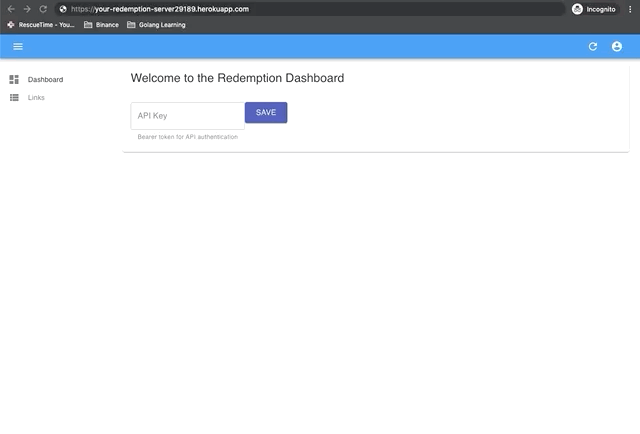
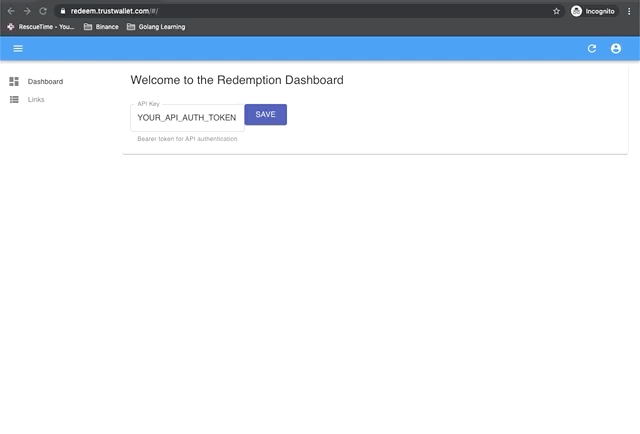

# Redemption Server

This is an open source tool that allows you to generate single-use links that redeem crypto to Trust Wallet. It can be used to run a gift card or promotional airdrop campaign.

Redemption currently supports Binance Chain, and will add support for more chains over time.

> Redemption is beta software, and currently has the bare-minimum of security features. Use at your own risk!

## Quick start

1. Deploy this template to Heroku. It should guide you through the setup process, including setting the secret API_AUTH_TOKEN

2. Navigate to the Heroku URL (e.g. https://your-redemption-server29189.herokuapp.com) and enter the `API_AUTH_TOKEN` that you chose in Step 1 in the dashboard.

3. Use the dashboard to create links. We use [Trust Wallet's Assets Info](https://github.com/trustwallet/assets) for token IDs (e.g. BNB for Binance Coin, BUSD-BD1 for Binance USD). 

4. Use the "links" dashboard to edit and invalidate links where necessary.

## Features

**Creation**

-   [x] A simple dashboard GUI allows the creation of _n_ one-use redemption codes (version 2 is currently underway in branch `antd`)
-   [x] Each one-use redemption code is tied to a specified amount of cryptocurrency

**Redemption**

-   [x] Redemption POST API sends cryptocurrency to the user if the redemption code is correct and valid
-   [x] Checks that redemption codes are unclaimed
-   [x] Race condition prevention (double-spend)
-   [x] Tiebreaking algorithm if two users scan at the same time

**Dashboard and Admin**

-   [x] Visual dashboard to track all redemption codes
-   [x] User can invalidate unclaimed redemption codes from dashboard

**Deployment**

-   [x] Heroku Autodeploy script
-   [ ] `npm start` at root should start both backend and frontend (docker?)

## Structure

-   [x] Document use of [react-admin](https://github.com/marmelab/react-admin)
-   [x] Document go backend API

## License

MIT licensed
